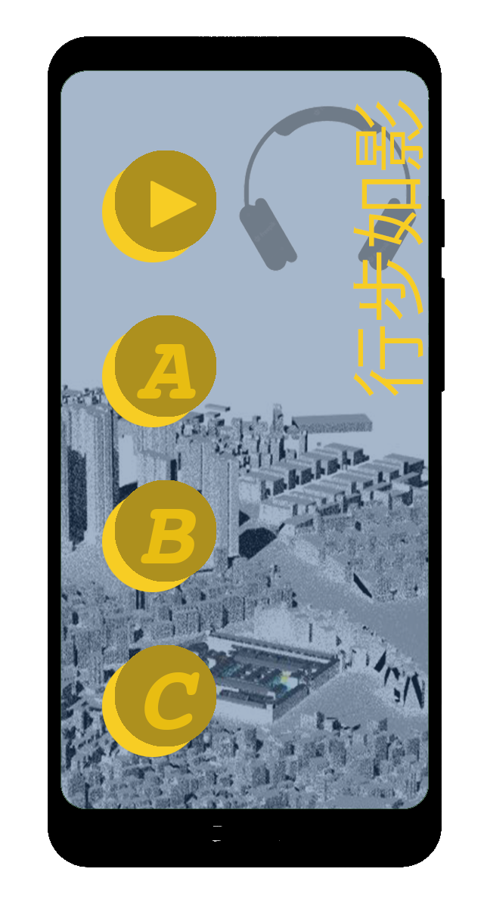

# DS345 Sound Design
Fall 2022  

[back](index.md)  

## Final Project

Each group will present a larger creative project primarily in sound: an audio walk that is conceptualized, produced, presented, and documented at high quality.  

#### Sound Piece
- Duration: 15 min piece for headphones (content) and 2x 30sec-5min loop for starting and ending loudspeaker (atmosphere)
- format: piece for bluetooth headphones (2-channel audio), start loop for outdoor speaker (1-channel), ending loop for outdoor speaker (1-channel)
- it has to respond, in some way, to the UABB proposal topic: Unwalking offers an event that engages the echo of the river flowing by the village that connects and transforms into an ecological system beyond the village. 
- the genre is free: it can be an audio story telling, a museum-style audio guide, an audio tour, a soundscape composition, a sonic architecture, a narration/narrative, an abstract piece, etc. (whatever genre is chosen, the expectation is the highest possible quality)
- can be a fixed composition / sound design, or an interactive, non-linear sound design
- it needs to contain: at least 1 field recording, at least 1 synthetic sound (self-made)

#### Additional Parts of the Project
- Web UI for mobile phones that controls and plays the sound
- Flow chart of the Web UI
- Map of the walking route
- Script of the sound piece
- Title, in response to "UNWALKING"
- Description text (max 400 words)
- Visual presentation of the project
  
#### Web UI / Web Audio Player
Each project must include an App UI / Web Audio Player that is made by you. The minimal requirement is a "start" button that starts the sound walk file (mp3), and a simple, professional-looking user interface for mobile phones, made with HTML, CSS, JavaScript, and Web Audio API (Tone.js).

#### Visual Presentation of the Project ("Teaser")
- A visual interpretation of your sound walk must be produced as part of the final project
- format and genre are open: it can be a video that includes the actual audio piece in its sound track, or it can be a series of slide shows and graphical materials, such as time and space mappings, catalogued pictures, etc; it can be an animated poster, or it can be a website (whatever format/genre is chosen, the highest quality is expected)
- The duration of the visual presentation should be around 1-3 min (or longer, if desired and discussed with the teacher)
- The visual presentation, together with the sound, must give a good experience of the sound walk, so that it can be exhibited elsewhere in the future (in physical exhibitions and online)

#### Address Learning Goals
With your final project, please clearly demonstrate your skill/mastery according to the four learning goals:
1.	Critically describe the potential of sound in media applications
2.	Apply listening skill, audio and affect vocabulary to describe sound
3.	Present experimentation in sound generation, composition, and editing
4.	Propose, craft, and deliver their own high-quality creative project in sound

#### Interim Review
- A rough draft of all parts of the project is expected
- Time for the interim review: 15 min per group (5 min of sound playback with or without visuals, 5 min of presentation, 5 min of Q&A)

#### Final Project Submission
Upload the following materials by *Wednesday midnight (23:59 on Nov 30, 2022)*, to the OneDrive folder, under "submission final project / group name":  
(in one or several PDF):
- Title, in response to "UNWALKING"
- Description text (max 400 words English + equivalent Chinese)
- Map of the walking route
- Script of the sound piece
- Flow chart of the Web UI 
- Statement/note indicating which team members made which project parts  

(upload on the public web server by the same date/time):
- web UI project including sound files and other required media  

#### Final Review
On December 1, morning, each group will have 15 minutes to present their project to an audience that doesn't know the projects yet. These 15 minutes are ideally split as follows:
- 5min of sound walk
- 5min of the group introducing the project
- 5min of Q&A with the audience
If the weather allows, the final review will take place outdoors on the sidewalk. Prepare accordingly: no screen will be available to present any slides. If you want to show slides or graphic materials, you need to be creative and prepare yourselves. You can show things on a tablet an walk around, or you can print a few A3 "slides" that you can show, if you need that.

#### Visual Documentation/Presentation Submission
By Tuesday midnight (23:59) on Dec 6, 2022, upload your visual documentation/presentation/"teaser" to the OneDrive under "submission visual presentation / group name".   

  
