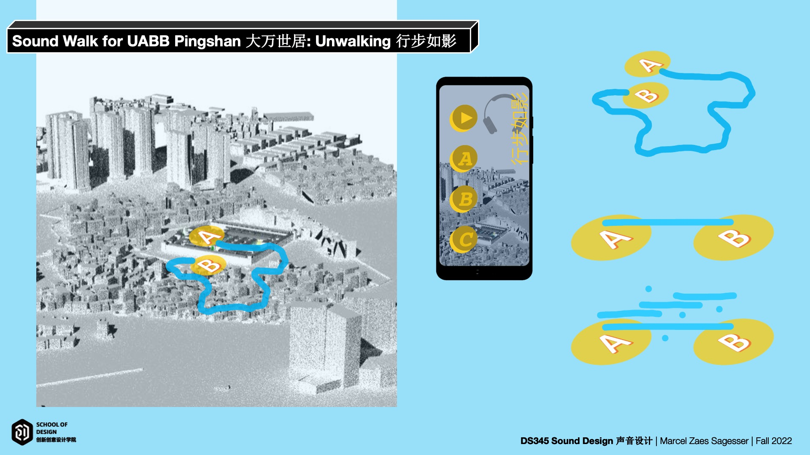

# DS345 Sound Design
## Designing a Sound Walk for the Hong Kong & Shenzhen Bi-City Biennale of Urbanism/Architecture (UABB2022)
Fall 2022  

#### Resources

[Course overview](https://sustechsd-my.sharepoint.com/:b:/g/personal/marcel_sagesser_sustechsd_onmicrosoft_com/EbfTFr-KuvVJlKsDVvnEV5oBfEx0JhLsL4cdgevBU9O4SQ?e=osQRMp)  
[Shared OneDrive Folder](https://sustechsd-my.sharepoint.com/:f:/g/personal/marcel_sagesser_sustechsd_onmicrosoft_com/ElidxVseY31NmgSjtAWDrXUB9vPWbjcxlGBdlE-ZL5-7aA?e=vv9OPI)  
[Approaches to Sound](https://sustechsd-my.sharepoint.com/:b:/g/personal/marcel_sagesser_sustechsd_onmicrosoft_com/Edci-vUlFpVOkMFwf9ilNp8BM77_uFVZbx0Tue1Oo9fsBg?e=2a9XxE)  
[Recordings by Judy/Iris/Lance](https://sustechsd-my.sharepoint.com/:f:/g/personal/marcel_sagesser_sustechsd_onmicrosoft_com/EiT0IzhJws5JjQZMUHYWzLQBdsij6ts_GaH80EcCtrz87g?e=h3xHEb)  
[Learning Goals](learninggoals)  
[Final Project assignment](finalproject.md)

#### Software & Tech Resources
##### Adobe Audition
[Adobe Audition - Tutorials EN](https://helpx.adobe.com/audition/tutorials.html)  
[Adobe Audition - Tutorials CN](https://helpx.adobe.com/cn/audition/tutorials.html)  

### VCV Rack 2
[VCV Rack 2 - Download](https://vcvrack.com/)  
[VCV Rack 2 - Manual and Tutorials](https://vcvrack.com/manual/)  

### Writing sound in code (programming)
[Tone.js](https://tonejs.github.io/)   

  
